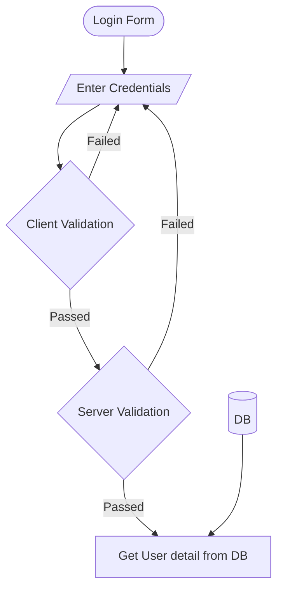

# User Login Flow
## Steps:
1. Start - Login Form
2. Enter Credentials
3. Client Validation
4. If Client Validation failed go back to step 2
5. if Client Validation passed check server validation
6. if Server Validation failed go back to step 2
7. if Server Validation passed fetch user with given credentials
8. if DB fetch error throw Server Error
9. If DB fetch success set the cookie with session and store it in DB

